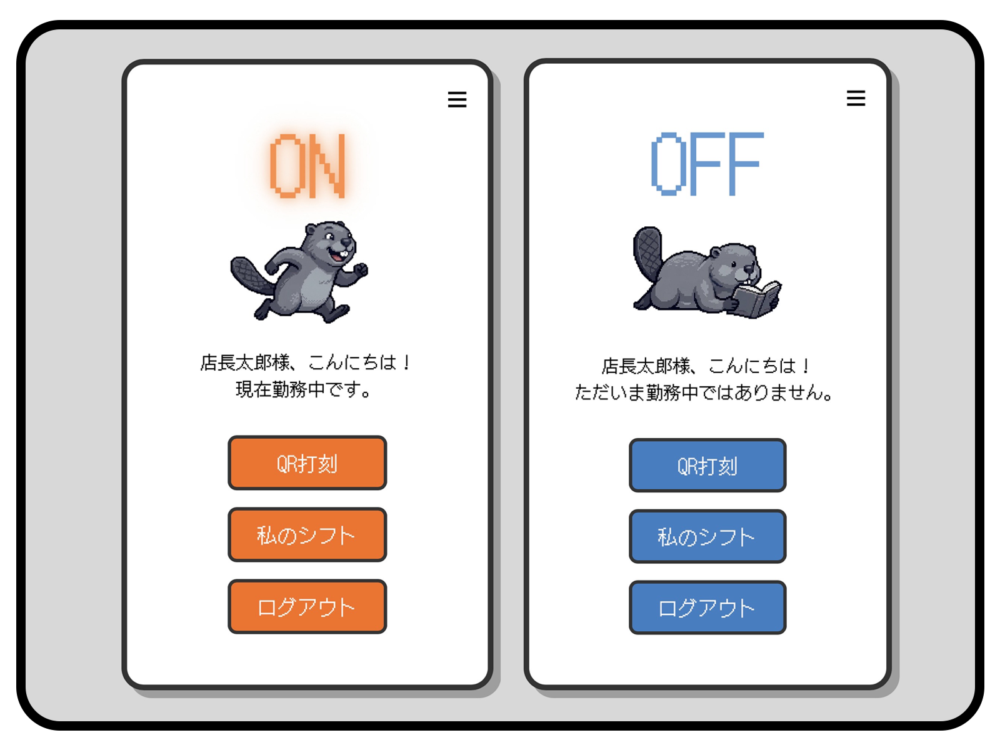
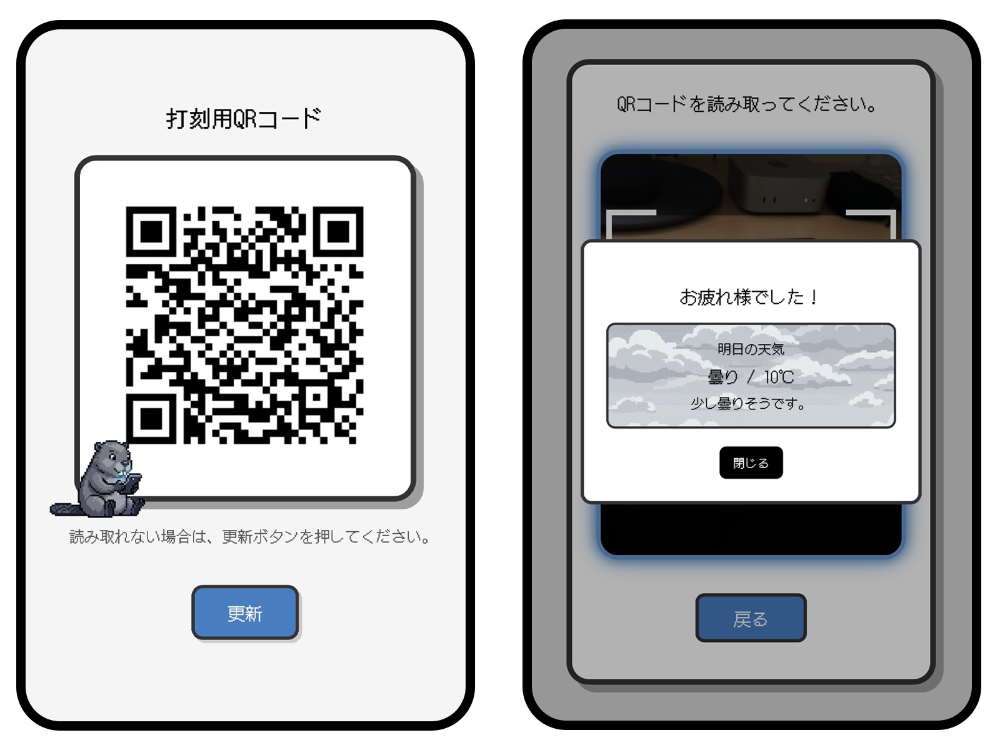
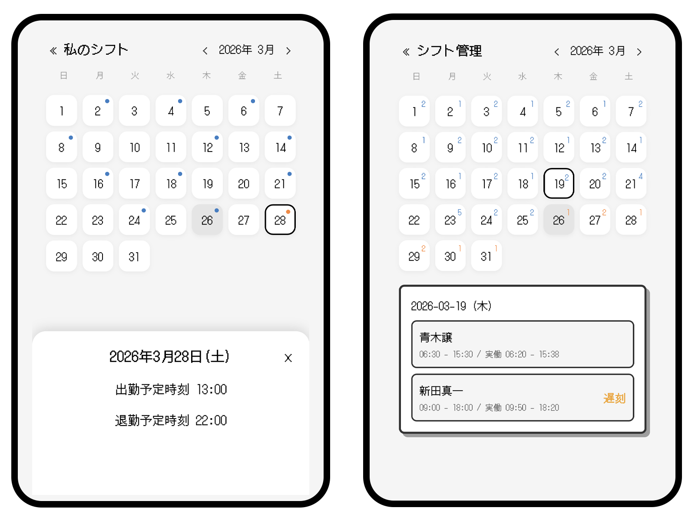
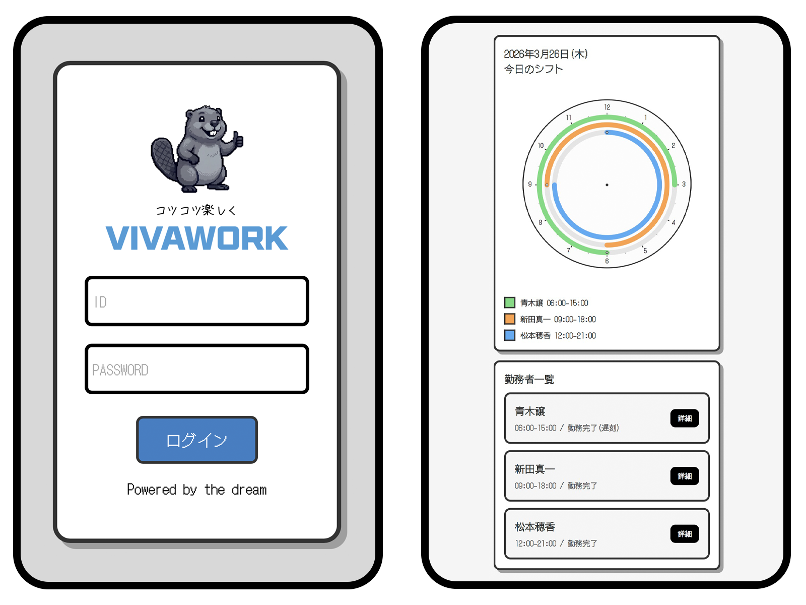

## プロジェクトの概要
* VIVAWORK - QRコードを用いた勤怠管理Webアプリケーション

## プロジェクトの目的
* 過去のサービス業界での勤務経験に基づいた現場スタッフ中心の勤怠アプリケーションを企画
* レトロゲーム風デザインで、「勤怠管理」という言葉から生じる心の負担を軽減

## 技術スタック
* Frontend - HTML, CSS, JavaScript, Thymeleaf
* Backend - Java, Spring Boot, JPA
* Database - MySQL
* Tools & Libraries - ZXing, html5-qrcode

## 主な機能
### USERとADMINの共通機能
* QR打刻 - QRコードによる出勤、退勤処理
* 私のシフト - 月間シフト確認(前月、当月、翌月)
### ADMIN専用機能
* ダッシュボード - 今日の勤務者および勤務者情報などを一目で確認
* シフト管理 - 社員の月間シフトおよび勤怠(出勤、退勤、遅刻、早退)確認、新しいシフトの作成と削除
* 社員ID管理 - 社員アカウントの情報修正、PW変更、削除
* 新規ID作成 - 新入社員のアカウント作成

## システム構成
### Frontend
* Thymeleafによるサーバーサイドレンダリングを採用し、シンプルかつコンパクトなUIを実現
### Backend
* Controller - リクエスト受付および認証・権限制御
* Service - ビジネスロジックおよびデータ処理
* Repository - データベースアクセス
### Database
* 社員(Employee)、シフト(Shift)、打刻(Attendance)、QRトークンの情報管理

## 工夫点・トラブルシューティング
#### QRコードの再使用防止
* 有効時間の設定および使用直後のトークン削除などの対策で、QRコード再使用の危険に備えました。
#### 退勤打刻し忘れの対応
* 退勤打刻をしないことにより打刻データ(Attendance)が不完全になる問題があったため、一定時間が過ぎると自動的に退勤打刻が処理されるよう実装しました。
#### パスワードのセキュリティ対応
* セキュリティ強化のため、BCrypt暗号化とmatches()による認証方式を実装しました。

## 実行方法(Docker)
Java17およびDockerのインストールが必要です。

1. リポジトリをクローンし、PCにプロジェクトを保存します。
2. プロジェクトのルートディレクトリに「.env」ファイルを作成し、以下を記入してください。
     
     DB_USERNAME=(任意)
     DB_PASSWORD=(任意)
      
3. ターミナル(コマンド)でプロジェクトのディレクトリに移動し、以下のコマンドを実行します。
    
    ./gradlew build -x test
    docker compose up --build
     
4. Webアプリケーションを起動します。
    
    - PCの場合：localhost:8080
    - スマートフォンの場合：（ローカルIPアドレス）:8080
    - 打刻用QRコード表示：localhost:8080/qr/display
    - テスト用アカウント：ID-admin / PW-1234
    
* DBテーブルはJPA、初期データはdata.sqlにより自動生成されます。
* QRコード読み取りの際、カメラアクセスのためngrokなどを利用したHTTPS環境が必要になる場合がございます。

## スクリーンショット

